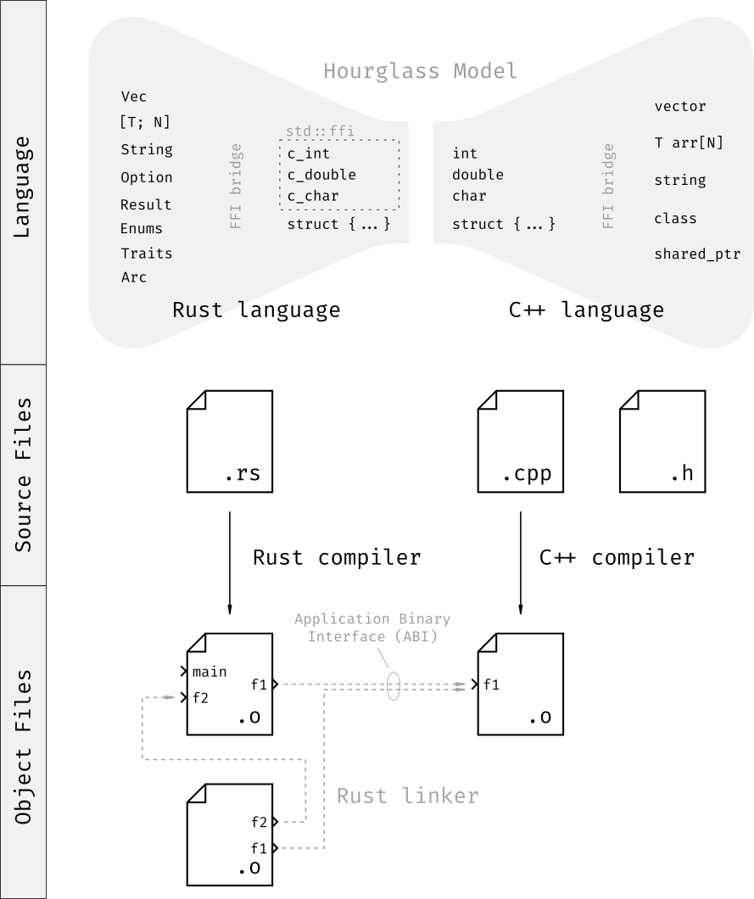

# Teil 1 - Interoperabilität zwischen C++ und Rust - Grundlagen

## Abstract

Dieser Artikel stellt der erste Beitrag zu einer vierteiligen Serie über die Integration und Migration von C++ in Rust dar.

## Vorwort

Viele Unternehmen stehen derzeit vor derselben Frage: Soll eine bestehende C++-Codebasis durch eine sichere Rust-Implementierung teilweise oder langfristig vollständig ersetzt werden.
Gerade Hersteller mit hohen Sicherheits- oder Compliance-Anforderungen (z.B. im Kontext des EU Cyber Resilience Act) geraten zunehmend unter Druck und sind bereit gezielt in Massnahmen zur Erhöhung der Softwaresicherheit zu investieren.
Rust bietet Sicherheitsgarantien zur Compile-Zeit, die andere Sprachen wie C++ nur durch Disziplin und Erfahrung der Programmierer erreichen können.
Durch ein konservatives Ownership- und Borrowing-Modell schränkt Rust die Programmierfreiheit bewusst ein - mit dem Ziel, ganze Klassen von Fehlern wie ungültige Speicherzugriffe und Racing-Conditions bereits beim Kompilieren auszuschliessen.
Gerade diese Fehler treten in C++ häufig nur sporadisch zur Laufzeit auf und sind schwer reproduzierbar.
Indem Rust solche Probleme frühzeitig verhindert, steigert es nachweisbar die Zuverlässigkeit und somit auch das Vertrauen in das Produkt.

Die Migration von C++ nach Rust ist jedoch auch mit Unbekannten verbunden:
Lässt sich der C++-Code mit einem Tool zuverlässig auf Rust übersetzen?
Gibt es gebrauchte C++-Konstrukte, die gar keine direkte Entsprechung in Rust haben?
Oder, verhalten sich scheinbar äquivalente Objekte in C++ und Rust zur Laufzeit tatsächlich identisch?
Solche Unbekannten erschweren eine realistische Aufwandsschätzung für eine Migration und können sogar zum Scheitern des Vorhabens führen.

Eine praxistaugliche Alternative ist deshalb die schrittweise Migration, bei welcher nur isolierte Komponenten nach Rust portiert werden und über C-Schnittstellen mit dem Legacy-C++-Code kommunizieren.
Besteht das Programm aus gut abgrenzbaren Komponenten, bietet der Ansatz mehere Vorteile:

* **Priorisierung**: Sicherheitskritische, komplexe oder nicht aktiv gewartete Komponenten können bewusst später migriert werden, wenn Zeit und Ressourcen verfügbar sind.
* **Risiko-Minimierung**: Das Risiko für ein Misslingen einer Migration sinkt und nach jeder erfolgreichen Teilmigration steigt die Planbarkeit weiterer Schritte.
* **Akzeptanz**: Eine Teilmigration ist firmenpolistisch weitaus weniger heikel wie eine Vollmigration.

Allerdings ist dieser Ansatz nicht kostenlos.
Die C-Schnittstelle limitiert den Datenaustausch zwischen den Sprachen, was oft eine nicht triviale Umstrukturierung der Datenmodelle erfordert.
Zudem reduziert sie die Entwicklungsgeschwindigkeit, da die Schnittstelle als sprachübergreifender Vertrag gilt, dessen Änderung mit erheblichem Abstimmungs- und Anpassungsaufwand verbunden ist.

Die vierteilige Serie über die Integration und Migration von C++ in Rust führt unsere allgemeine Artikel-Serie mit der letzten Ausgabe [Rust - Moderne Softwareentwicklung mit Sicherheit und Performance](https://cudos.ch/de/news-insights/rust-moderne-softwareentwicklung-mit-sicherheit-und-performance/) weiter.

1. **Teil 1 - Interoperabilität zwischen C++ und Rust - Grundlagen**: Der erste Teil beleuchtet die technischen Grundlagen der Interoperabilität zwischen C++ und Rust und zeigt, wie sie als Mittel für eine schrittweisen Migration genutzt werden kann.
2. **Teil 2 - Grenzen der C++- und Rust-Interoperabililtät**: In einem zweiten Teil, werden die Grenzen der Interoperabilität besprochen, um realistische Erwartungen zu setzen, Risiken und Abhängigkeiten frühzeitig zu erkennen und daraus fundierte Migrationsentscheidungen ableiten zu können.
3. **Teil 3 - Sicherheit durch die Einbettung von C++ in Rust**: Der dritte Teil zeigt auf wie die Sicherheit durch Einbettung von C++ code in Rust verbessert werden kann.
4. **Teil 4 - Automatisierte Code-Übersetzung von C++ nach Rust**: Im vierten Teil werden Werkzeuge zur automatisierten Quellcode-Migration von C++ nach Rust vorgestellt.

## Das Sanduhr-Modell

Der C++- und Rust-Code kommunizieren miteinander über eine C-kompatiblen Schnittstelle.
In C++ enspricht diese Schnittstelle einer Teilmenge der eigenen Standard-Sprachkonstrukte, während sie in Rust über das Modul `std::ffi` (Foreign Function Interface) bereitgestellt wird.
Dabei müssen Datentypen, die in einer Sprache definiert und in der anderen verwendet werden sollen, zunächst auf C-kompatiblen Grundtypen reduziert (über eine sogenannte FFI-Bridge) und in der anderen Sprache wieder zusammengebaut werden.
Zum Beispiel muss ein `std::vector` in C++ als C-Array uminterpretiert werden, um schliesslich in Rust zu einem `Vec` wieder zusammengesetzt zu werden.
Dieses Prinzip wird als *Sanduhr-Modell* (hourglass model) bezeichnet (wie im Bild unten dargestellt):
Die C-Schnittstelle bildet den schmalen, gemeinsamen Kern ("Hals") zwischen den beiden Sprachen, während die beiden Aussenseiten aus den komplexeren Datentypen von Rust und C++ bestehen.

Mit der C-Schnittstelle des Sanduhr-Modells wird ein anwendungsspezifisches Application Binary Interface (ABI) definiert. Das ABI beschreibt, wie Funktionen und Datenstrukturen auf Binarebene zwischen Programmen ausgetauscht werden, welche in unterschiedlichen Sprachen kompiliert wurden. Es umfasst under anderem die Aufrufkonventionen, die Speicheranordung von Datenstrukturen sowie die Namenkonventionen (Name-Mangling). Über dieses ABI können Funktionen, die in einer Sprache implementiert wurden, von der anderen aufgerufen werden.

Im Gegensatz dazu beschreibt ein Application Programming Interface (API) die Schnittstelle auf Quellcode und nicht auf Binärebende. Diese Unterscheidung wird deutlich, wenn man den Build-Prozess betrachtet (siehe Bild oben): Rust- und C++-Compiler übersetzen ihren jeweiligen Quellcode unabhängig voneinander in Objektdateien (.o). Erst im zweiten Schritt werden diese Objektdateien durch den Linker zu einem gemeinsamen Binärprogramm zusammengefügt — dieser Vorgang erfolgt ohne direkte Kontrolle durch einen der Compiler. Während die Verlinkung von Objektdateien innerhalb einer Sprache vom jeweiligen Compiler garantiert korrekt funktioniert, ist die Verknüpfung zwischen Rust- und C++-Objekten fehleranfälliger. Hier muss sichergestellt werden, dass beide Seiten das gleiche ABI einhalten — sonst kann es zu undefiniertem Verhalten, Speicherfehlern oder Abstürzen kommen.

Cargo ist das Build- und Packetverwaltungssystem von Rust - vergleichbar mit CMake für C++.
Der Hauptzweck von Cargo ist das Kompilieren, Verwalten von Abhängigkeiten und Veröffentlichen von Rust-Projekten in Form von sogenannten Crates.
Es kann aber auch Tools wie CMake integrieren, um C++-Quellcode zu kompilieren.
So kann der ganze Rust- und C++-Buildprozess durch einen einzigen Aufruf von Cargo orchestriert werden.
Darin enthalten ist das kompilieren von C++-Code durch CMake, das kompilieren von Rust-Code und das Verlinken der Objektdateien.
Der Buildprozess wird in einer dafür reservierten Datei `build.rs` definiert.

## Werkzeuge im Überblick

Eine C-kompatible Schnittstelle zwischen zwei Sprachen zu implementieren, ist möglich, aber ohne Hilfsmittel nur schwer zuverlässig und fehlerfrei umzusetzen.
Dies liegt daran, dass die Speicheranordnung von C-Typen nicht vollständig standardisiert ist, sondern vom Compiler, Zeilplattform, und anderen Faktoren abhängt.
So kann es vorkommen, dass vermeintlich identische C-kompatible Datenstrukturen in Rust und C++ unterschiedlich im Speicher angeordnet werden – mit potenziell fatalen Folgen.
Um solche Fehler zu vermeiden, existieren verschiedene Werkzeuge, die das Definieren von Schnittstellen automatisieren und teilweise sogar deren Korrektheit statisch überprüfen.
Für die Interoperabilität zwischen Rust und C++ stehen heute mehrere Ansätze zur Verfügung – je nachdem, ob der Fokus auf C-Kompatibilität oder einer idiomatischen Nutzung beider Sprachen liegt.

### bindgen und cbindgen

Das bindgen-Crate generiert aus existierenden C-Header-Dateien (.h) automatisch die entsprechenden Rust-Funktions- und Typdefinitionen.
In der Praxis wird C++-Code oft zunächst durch einen dünnen C-Wrapper gekapselt, aus dem bindgen dann eine Rust-Schnittstelle ableitet.
Darauf aufbauend kann eine sichere, idiomatische Rust-API erstellt werden, die ohne manuelles Übersetzen der Funktionssignaturen auskommt.

Das cbindgen-Crate funktioniert in die entgegengesetzte Richtung:
Es erzeugt aus Rust-Code automatisch eine C-kompatible Header-Datei, die von C- oder C++-Projekten eingebunden werden kann.
So lassen sich Rust-Bibliotheken direkt aus C++ heraus nutzen – etwa zur schrittweisen Integration von Rust-Komponenten in bestehende Systeme.

### cxx

Das cxx-Crate verfolgt einen grundlegend anderen Ansatz.
Anstatt eine bestehende C-Schnittstelle zu übersetzen, wird die gemeinsame Schnittstelle deklarativ in Rust definiert – mithilfe eines speziellen Makros.
Aus dieser Beschreibung generiert cxx automatisch die passenden Bindings sowohl auf Rust- als auch auf C++-Seite.
Dadurch ist sichergestellt, dass die Schnittstellen immer konsistent bleiben – auch wenn sie sich weiterentwickeln - und potenzielle Fehler werden bereits zur Kompilierzeit erkannt.

cxx versteht gängige Standardtypen beider Sprachen (z. B. String, Vec, etc.) und kann diese sicher zwischen Rust und C++ abbilden.
Zudem führt cxx eine statische Analyse durch, um unbeabsichtigte Datenveränderungen durch die jeweils andere Sprache zu verhindern.
So wird beispielsweise unterbunden, dass Datenstrukturen by value von C++ nach Rust übergeben werden, wenn diese durch das Move-Verhalten von Rust zu unerwarteten Modifikationen führen könnte.
Darüber hinaus erlaubt cxx über die Verknüpfung mit C++-Templateinstanziierungen eine sichere Nutzung solcher generischen Typen auch auf Rust-Seite – ohne Speicher- oder Ownership-Verletzungen.

# Fazit

Die Interoperabilität zwischen Rust und C++ bietet ein großes Potenzial, bestehende Systeme schrittweise zu modernisieren und gleichzeitig sicherer zu gestalten.
Die dafür notwendige Sprachschnittstelle ist jedoch fehleranfällig und sollte – wo immer möglich – automatisiert erzeugt werden, etwa mit Werkzeugen wie bindgen oder cxx, die im Fall von cxx sogar eine statische Überprüfung der Schnittstelle durchführen.
Trotz dieser Unterstützung bleiben gewisse Einschränkungen beim Datenaustausch zwischen den Sprachen bestehen – etwa beim Zugriff auf Stack-Variablen oder bei der Nutzung asynchroner Funktionen.
Wie sich diese Limitierungen im Detail auswirken und welche Lösungsansätze es gibt, beleuchten wir im nächsten Teil dieser Serie.
