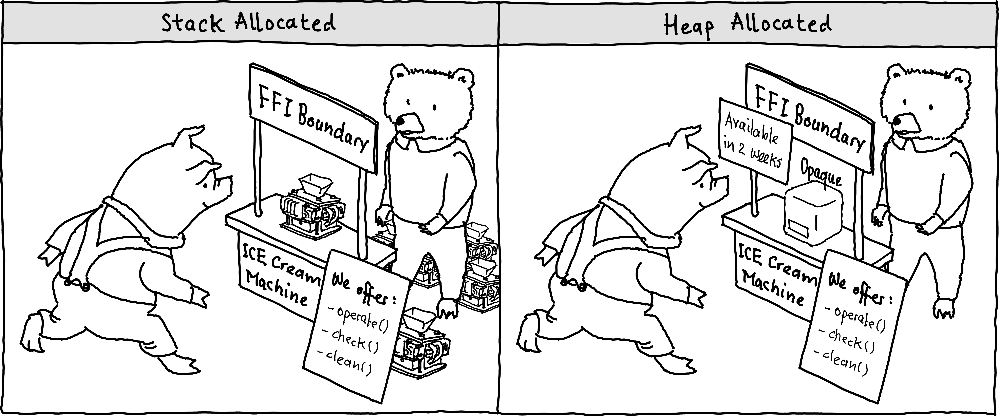

# Teil 2 - Grenzen der C++- und Rust-Interoperabilität

## Abstract

Dieser Artikel stellt den zweiten Beitrag zu einer vierteiligen Serie über die Migration und Integration von C++ in Rust dar.

## Vorwort

Wie im letzten Teil unserer Serie gezeigt wird, ist die Integration von C++ in Rust technisch möglich, geht jedoch mit Einschränkungen einher.
Diese beruhen darauf, dass die in C++ und Rust kompilierten Komponenten über eine C-kompatible Schnittstelle - ein sogenanntes Foreign Function Interface (FFI) - kommunizieren.
Diese Schnittstelle limitiert nicht nur die Geschwindigkeit, mit der Daten zwischen den Sprachen ausgetauscht werden, sondern erhöht auch den Entwicklungsaufwand.
Daher ist es wichtig, die Grenzen der Schnittstelle zu kennen.
Nur so lassen sich der Aufwand realistisch abschätzen, die technischen Risiken bewerten und eine fundierte Entscheidung treffen, ob und in welchem Umfang eine Integration von C++ in Rust überhaupt sinnvoll ist.

Dieser zweite Teil unserer Artikelserie beleuchtet die wichtigsten technischen Grenzen der Interoperabilität. Im Fokus stehen drei zentrale Aspekte:

* **Leistungseinbussen** – Eine FFI-Schicht bringt zwangsläufig gewisse Performance-Kosten mit sich.
* **Opake Datentypen** – Manche Datenstrukturen lassen sich nicht direkt über das FFI abbilden und müssen daher als opake Typen eingekapselt werden.
* **"Move"-Verhalten** – C++ und Rust unterscheiden sich grundlegend darin, wie Objekte verschoben und referenziert werden, was zu unerwarteten Problemen führen kann.

Abgerundet wird der Artikel durch weitere Hindernisse sowie ein Fazit, welches die Grenzen der Interoperabilität zusammenfasst.

## Leistungseinbussen

Die Einführung einer FFI-Schnittstelle führt im Idealfall nur zu geringen Leistungseinbussen.
Auch reine C++-Programme kommunizieren intern über binäre Schnittstellen zwischen Objektdateien, die der Linker zu einem gemeinsamen Programm zusammenführt.
Würde eine solche binäre Schnittstelle von der jeweils anderen Sprache perfekt nachgebildet, liessen sich Leistungseinbussen vollständig vermeiden.

In der Praxis ist dieses Szenario jedoch nur schwer zu erreichen.
Zum einen sind Optimierungen des Compilers wie Inlining oder Dead-Code-Elimination über die Sprachgrenze hinweg nicht möglich, was die Performance einschränkt.
Zum anderen müssen Objekte, die über die Sprachgrenze hinweg verwendet werden, bitgenau übereinstimmen.
Das ist fehleranfällig und erfordert bei jeder Anpassung des binären Speicherlayouts eine sorgfältige, manuelle Anpassung auf beiden Seiten.
Damit wächst das Risiko, dass selbst kleine Änderungen zu undefiniertem Verhalten oder subtilen Fehlern führen, welche erst spät in der Software-Release-Pipeline entdeckt werden.

Eine verbreitete Alternative ist die Verwendung opaker Datentypen, wie im nächsten Kapitel beschrieben.
Dies erleichtert die Handhabung komplexer Objekte, ist jedoch mit zusätzlichen Leistungseinbussen verbunden.

## Opake Datentypen

Ein zentrales Konzept zum Verständnis der Interoperabilitätsgrenzen sind opake Datentypen.
Zur Veranschaulichung kann man sich eine Analogie zu einem Verkaufsstand für Eismaschinen vorstellen (siehe Abbildung unten).
Der Verkäufer und der Kunde repräsentieren die beiden Programmiersprachen, während der Verkaufsstand der FFI-Schnittstelle entspricht.
Der Verkäufer übergibt dem Kunden das Produkt ausschliesslich über diesen Stand – genauso wie eine Sprache ein Datenobjekt über die FFI-Schnittstelle an die andere übergibt.
Die Produktübergabe (also der Datenaustausch) kann auf zwei Arten erfolgen:

1. **Stack-Allokation** -
Die Eismaschine ist modular aufgebaut und sofort verfügbar, jedoch anfällig für Störungen, wenn sie nicht korrekt gehandhabt wird.
Dies entspricht Daten, die auf dem Stack liegen.
 Sie lassen sich sehr effizient übertragen, müssen jedoch auf Binärebene in beiden Sprachen exakt gleich dargestellt werden.
Zudem entsteht bei komplexen Datenstrukturen zusätzlicher Aufwand, weil sie zunächst auf einfache, C‑kompatible Grundtypen abgebildet werden müssen.

2. **Heap-Allokation** -
Die Eismaschine ist erst später lieferbar, dafür aber einfach zu bedienen und wenig wartungsintensiv.
Dies entspricht Daten, die auf dem Heap liegen.
Die Heap-Allokation verursacht zwar spürbare Verzögerungen, ermöglicht aber, den Datentyp opak zu halten.
Dies bedeutet, dass das Speicherlayout der Daten verborgen bleibt; der Empfänger erhält lediglich einen Pointer und interagiert ausschliesslich über klar definierte Funktionen.

Die Verwendung von opaken Datentypen reduziert Kopplung und Fehlerrisiko.
Änderungen an der internen Datenstruktur erfordern keine Anpassungen auf der Gegenseite, solange die öffentliche Schnittstelle stabil bleibt.

Ein weiterer Anwendungsfall opaker Datentypen ist die Einbindung von Datenstrukturen, deren Binärrepräsentation instabil oder vom Compiler abhängig ist.
Dazu gehören etwa Dateien- oder Socket-Handler, Closures, Mutex-Implementierungen oder andere komplexe Laufzeitobjekte.
Solche Typen können sich je nach Compiler, Plattform oder Version der Standardbibliothek unterscheiden und sind daher nicht zuverlässig direkt über die FFI abbildbar.
Opake Datentypen verbergen die Compiler-abhängige interne Struktur dieser Objekte, während die Gegenseite nur über eine klar definierte API mit ihnen interagiert.

Zusammengefasst erhöhen opake Datentypen die Benutzerfreundlichkeit und Stabilität der Schnittstelle, gehen jedoch zu Lasten der Performance.

## Move-Verhalten

Die bisher besprochenen Grenzen der Interoperabilität gelten allgemein für FFI zwischen zwei Sprachen.
Es gibt jedoch auch eine Inkompatibilität spezifisch zwischen C++ und Rust:
Den Umgang mit selbstreferenziellen Datentypen.
Ein selbstreferenzieller Datentyp ist ein Objekt, das intern einen Zeiger auf sich selbst enthält.
In C++ kommen solche Konstrukte häufig vor – etwa bei Iteratoren, aber auch bei Strings oder Vektoren können sie je nach Compiler nicht ausgeschlossen werden.
C++ kann diese Objekte sicher im Speicher verschieben, weil der Move-Konstruktor dafür sorgt, dass der interne Zeiger nach dem Verschieben aktualisiert werden.
Rust hingegen erlaubt selbstreferenzielle Datentypen nur in streng kontrollierten Situationen.
Objekte, die nicht mehr im Speicher bewegt werden dürfen, werden als "gepinnt" markiert.
Beispiele dafür sind Futures oder bestimmte Generatoren.

Über die FFI-Schnittstelle können jedoch selbstreferenzielle Objekte aus C++ ohne Pin-Markierung nach Rust gelangen – und genau hier entsteht ein gefährliches Missverständnis.
Rust geht davon aus, dass alle nicht gepinnten Objekte frei und bitweise verschiebbar sind.
Wird ein selbstreferenzielles Objekt jedoch bitweise verschoben, bleibt der interne Zeiger unverändert und zeigt nach der Verschiebung nicht mehr auf das verschobene Objekt, sondern auf die alte Speicheradresse.
Das Ergebnis ist zwangsläufig undefiniertes Verhalten, das sich schwer debuggen lässt und potenziell sicherheitskritische Fehler verursacht.

Zusammengefasst können durch die FFI-Schnittstelle unvorhergesehene Fehlerfälle auftreten, die zwar zum Teil durch Tools wie cxx automatisch erkennt werden, sonst aber nur durch Disziplin vermieden werden können.

## Weitere Hindernisse

Neben den zuvor behandelten Themen gibt es eine Reihe weiterer praktischer Herausforderungen, die wir für besonders relevant halten:

* **Debugging** - Das Debuggen über die Sprachgrenze hinweg ist oft umständlich.
Viele Debugger können nicht nahtlos in Funktionsaufrufe der jeweils anderen Sprache "hineinspringen".
Unterschiedliche Calling Conventions, optimierende Compiler und eingeschränkt interpretierbare Stacktraces erschweren eine konsistente Analyse.
* **Async** - Asynchrones Programmieren über FFI ist nur eingeschränkt möglich. Rusts async-/await-Mechanismus und C++-Futures oder Coroutinen sind nicht direkt kompatibel.
Die Interoperabilität muss über Oneshot-Kanäle, Callbacks oder manuell verwaltete Event-Loops hergestellt werden, was zusätzlichen Aufwand und potenzielle Fehlerquellen mit sich bringt.
* **Sanitizer** - Laufzeit-Analysewerkzeuge wie AddressSanitizer, ThreadSanitizer oder UndefinedBehaviorSanitizer arbeiten oft nur eingeschränkt über Sprachgrenzen hinweg.
Wird ein Fehler ausgelöst, ist nicht immer klar ersichtlich, in welcher Sprache die Ursache liegt.
* **Threading-Modelle** - Rust kann keinerlei Thread-Sicherheitsgarantien übernehmen, wenn Objekte über die FFI-Schnittstelle ausgetauscht und manipuliert werden.
Die korrekte Benutzung der Schnittstelle muss mit der Dokumentation der Schnittstelle beschrieben und manuell korrekt umgesetzt werden.

Die Interoperabilität wird beim Design von Sprachen und deren Tooling häufig nur am Rande berücksichtigt.
Dies führt zwangsläufig zu zusätzlichen Hindernissen beim Umgang mit der FFI-Schnittstelle, die Entwickler einplanen müssen.

## Fazit

Die Interoperabilität zwischen C++ und Rust ermöglicht in vielen Projekten einen schrittweisen Umstieg oder eine gezielte Kombination beider Sprachen.
Gleichzeitig bringt dieser Ansatz jedoch technische Grenzen mit sich, die für eine realistische Aufwandsabschätzung wichtig zu verstehen sind.
Bei einer FFI-Schnittstelle sind gewisse Leistungseinbussen unvermeidbar, da Daten über die Sprachgrenze hinweg übertragen werden.
Im Gegenzug ist die FFI-Schnittstelle anfälliger für Fehler.
Schon kleine Änderungen an den übergebenen Typen oder an der API können die Schnittstelle instabil machen.
Zusätzlicher Aufwand entsteht auch, wenn komplexe Datentypen auf eine C-kompatible Repräsentation heruntergebrochen werden müssen.
Zudem müssen Datentypen, die nicht direkt über die Sprachgrenze übergeben werden können, opak gehalten werden und ein definiertes ABI für deren Manipulation bereitgestellt werden.
Darüber hinaus können unerwartete Fehler auftreten, etwa durch das unterschiedliche Move-Verhalten von C++ und Rust oder durch die eingeschränkte Wirksamkeit von Analysetools über die Sprachgrenze hinweg.
Trotz dieser Herausforderungen bietet die Kombination beider Sprachen Chancen, C++-Software gezielt zu modernisieren und in Rust sicherer zu gestalten.
